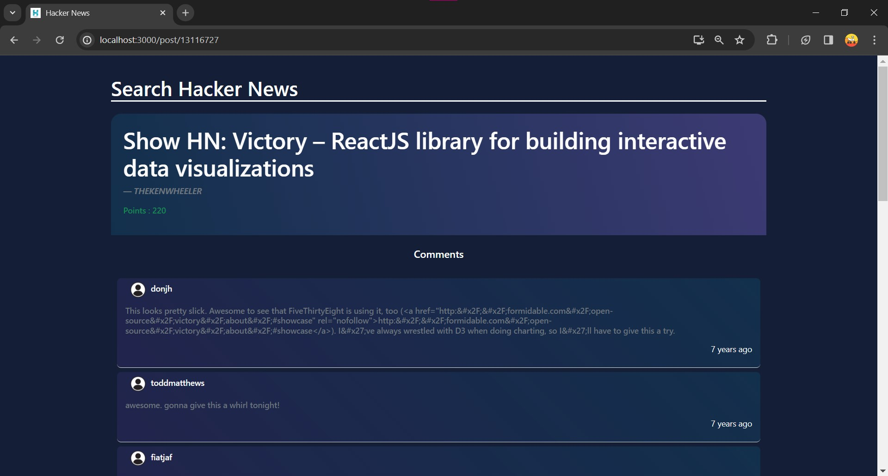

### Steps to configure and run app:

1. Open frontend folder in vscode 

2. Open a new terminal and run following commands,

```bash
   cd frontend
```
- if already in frontend folder skip above command and run below commands.

```bash
  npm install react-scripts
```

3. After that run frontend using below command,

```bash
  npm start
```

### Tech stack used:


### Project Screenshots 

<p align="center">
  
</p>
